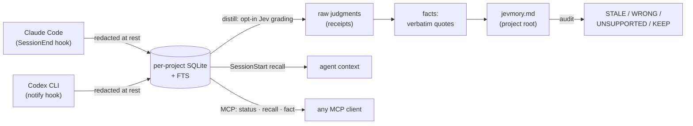

# jevmory — your coding agent's memory, with receipts

[](https://github.com/romiluz13/jevmory/actions/workflows/ci.yml)
[](pyproject.toml)
[](#status)
[](LICENSE)

Local, zero-dependency memory layer for coding agents. Every remembered
fact is a **verbatim quote** graded by [TypeSafe Jev](https://typesafe.ai)'s
calibrated confidence — and every number has a receipt.

```sh
jevmory audit MEMORY.md
```

```
your memory has 1 stale line, 1 wrong line, 1 unsupported line; 2 keep

LINE  VERDICT      CONF  SUPP  CONTRA  CLAIM
   5  STALE        0.82  0.34    0.71  The build runs on Bun; bun run build is the…
   6  WRONG        0.93  0.07    0.93  The test suite runs with pytest.
   7  UNSUPPORTED  0.85  0.06    0.05  Failed API requests retry up to five times…

receipts: run 1 · 1 api calls · 838 tokens · evidence: 0 facts, 6 statements
```

## The problem

Your coding agent forgets everything at session end. The usual fix — a
hand-maintained `MEMORY.md` — rots silently: stale lines, lines nobody
ever said, lines the project outgrew, and no way to tell which is which.
jevmory closes both ends: it remembers what was actually said (hooks
ingest every session locally), and it audits the memory file against
that evidence, verdict by verdict.

## What it does — four pillars

- 🎯 **Verbatim facts, zero generation** — no LLM generation anywhere.
  [Jev](https://typesafe.ai) judges; code selects and composes. Facts
  are quotes with verbatim context, so the memory can't hallucinate.
- 🔌 **Agent-agnostic** — a one-command Claude Code plugin, an MCP
  server (`status` / `recall` / `fact`) for Codex CLI, Cursor, and any
  MCP client, and Codex notify hooks. Same store, same receipts.
- 🛡️ **Local by architecture** — Python 3 stdlib only, per-project
  SQLite, secrets redacted at rest before storage, and grading gated
  behind an explicit per-project opt-in. No opt-in → nothing leaves.
- 📄 **Receipts for everything** — raw judgments and usage are stored
  (`runs`/`judgments` tables), so any number in any report traces to
  the API call that produced it.

## Quickstart

Requires Python ≥3.10 and nothing else — stdlib only, no pip deps.

**Plug-and-play with Claude Code** (no pip install — the plugin is
self-contained; the repo is both marketplace and plugin):

```sh
/plugin marketplace add romiluz13/jevmory
/plugin install jevmory@jevmory
```

That one install gives you: a SessionEnd hook that ingests every session
locally, a SessionStart hook that injects this project's top remembered
facts into context (fresh sessions, resumes, and post-compaction restarts
alike), the three read-only MCP memory tools, the `/jevmory:memory`
command, and a `jevmory` CLI on the Bash tool PATH — all vendored from
the plugin's own copy of the package. Remove it with
`/plugin uninstall jevmory`.

**Any MCP agent** (Codex CLI, Cursor, …) — add the stdio memory server:

```sh
jevmory mcp        # or: python3 -m jevmory.mcp
```

Point your agent at it as a stdio MCP server
(`command: python3`, `args: ["-m", "jevmory.mcp"]`). Three read-only,
fully local tools; no API key, no egress — grading stays in the CLI
where the opt-in gate lives.

**From source:**

```sh
git clone https://github.com/romiluz13/jevmory && cd jevmory

# in your project:
jevmory init                     # setup; the store appears on first ingest
jevmory install --agent claude   # prints the Claude Code SessionEnd hook JSON
jevmory install --agent codex    # prints the Codex notify snippet (--yes patches config)

# stay fully local (nothing ever leaves):
jevmory ingest --scan            # finds this project's transcripts and ingests
jevmory status                   # queued candidates, last ingest, errors
jevmory recall                   # the top facts, as the hook injects them

# or opt in to grading (needs $TYPESAFE_API_KEY):
jevmory init --enable-grading    # per-project opt-in marker
jevmory distill                  # grade queued candidates
jevmory audit MEMORY.md          # receipts for every memory line
jevmory resolve <id>             # answer a contradiction question

# closed network? run grading against a local server (no key):
jevmory audit MEMORY.md --backend kev   # jaredpalmer/kev on localhost
```

Add `jevmory.md` to your project's `.gitignore` if you don't want agent
memory in version control — it's yours, not the repo's.

**Try the demo first** — offline, deterministic, zero cost:

```sh
python3 demo/run_demo.py
```

A planted-error fixture: `demo/MEMORY.md` has 5 memory lines — 3 with
planted errors contradicted by the evidence in `demo/transcript.jsonl`.
Judgments are pinned offline, so the errors are guaranteed present and
the demo costs nothing. The live `jevmory audit` produces exactly the
output shown above, with real Jev judgments behind the numbers.

## How it works



Hooks ingest locally and always exit 0 — they can never break a session.
`distill` extracts and dedupes sentence candidates, then (only with your
opt-in) grades them: durability, category, significance, support,
contradiction. `audit` anchors lines that match a stored fact verbatim as
`VERIFIED` deterministically (zero API spend) and grades the rest against
the store's evidence. `jevmory.md` lands at the project root — grouped by
category, confidence-ordered, sentinel-guarded against silent overwrites.

Design laws and domain model: [docs/DOMAIN.md](docs/DOMAIN.md).

## Configuration & privacy

- **Fully local mode** — just never run `init --enable-grading`.
  Everything else (ingest, status, scan, recall, MCP) is local by
  architecture. No marker → candidates queue; `jevmory status` says so.
- **What leaves, and what never does** — the exact egress surface, the
  redaction list, and the honest caveat about verbatim quotes:
  [docs/PRIVACY.md](docs/PRIVACY.md).
- **Closed networks** — `--backend kev` grades against a local
  wire-compatible server (`$JEVMORY_KEV_ENDPOINT`, default
  `127.0.0.1:8009`); no key, no egress, opt-in still required.
- **Benchmarks** — budget-capped live smoke and the planted-truth
  fidelity benchmark: [docs/benchmarks/live-smoke.md](docs/benchmarks/live-smoke.md).

## Status

**Active.** 595 offline tests (the same `python -m unittest discover`
CI runs on 3.10–3.13) — no network, no API key, FakeJev including
adversarial mode. Modules M0–M7 complete; pipeline live-verified against
the real Jev API (probe, capped distill, audit). v0.2: two-stage audit
with deterministic `VERIFIED` anchoring, vintage receipts, and the `kev`
local grading backend. v0.3: plug-and-play — a self-contained Claude Code
plugin (marketplace + hooks + MCP tools + command), an agent-agnostic MCP
server for Codex/Cursor, and SessionStart recall injection; both plugin
manifests pass `claude plugin validate --strict`.

See [CONTRIBUTING.md](CONTRIBUTING.md) to get involved, and
[CHANGELOG.md](CHANGELOG.md) for history.

## License

MIT — see [LICENSE](LICENSE).
